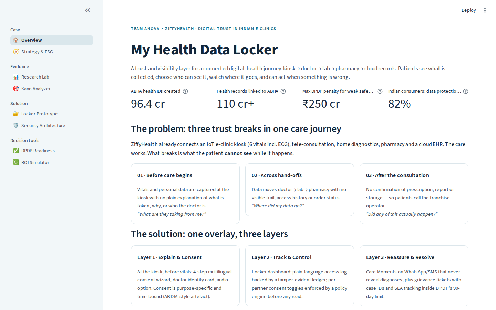
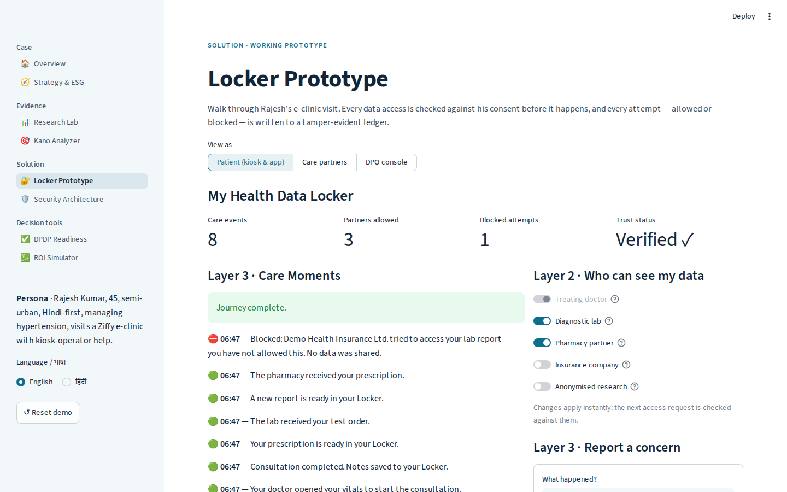
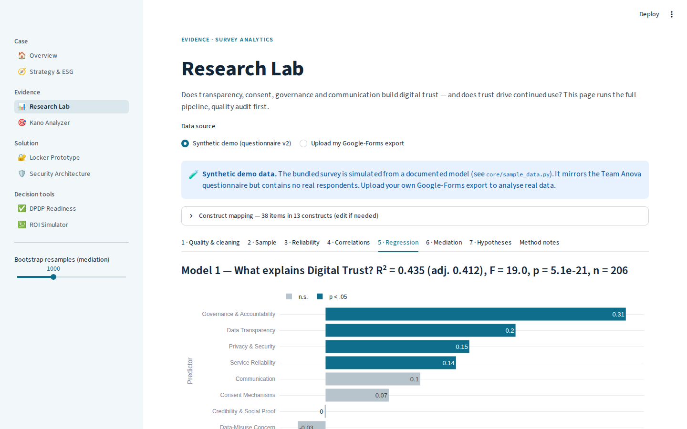
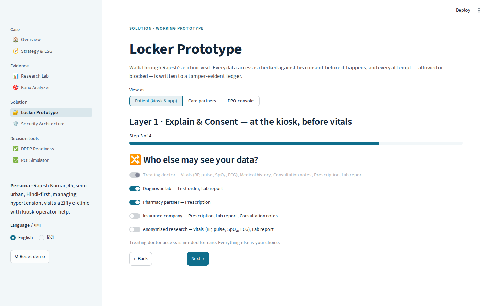
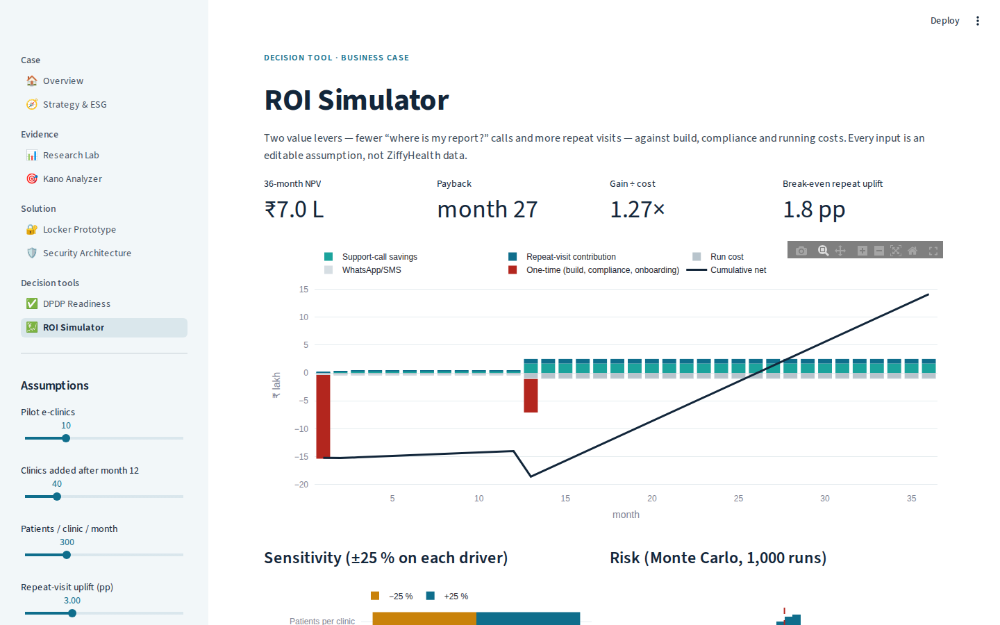

# 🔐 My Health Data Locker — Digital Trust Toolkit

**A trust and visibility layer for India's connected e-clinic journey, plus the research, security, compliance and business tooling behind it.**

Built from a WeSchool *Global Citizen Leadership* live project with **ZiffyHealth** (Pune) by **Team Anova**:
Anvesha Singh (Project Lead), Aastha Vithlani, Ajinkya Upasani, Raj Girase, Shriraam Sundar and Yukti Agarwal.
This repository is an independent, extended rebuild of the project for portfolio use.

> ⚠️ Concept prototype. Not affiliated with or endorsed by ZiffyHealth / Ziffytech Solutions Pvt Ltd.
> The bundled survey data is **synthetic** (see [Data card](docs/DATA_CARD.md)). Educational only — not legal or medical advice.



---

## The problem

ZiffyHealth connects an IoT e-clinic kiosk (6 vitals incl. ECG), tele-consultation, home diagnostics, pharmacy and a cloud EHR.
The care works, but the patient can't see what happens to their data along the way:

| Trust break | Patient's question |
|---|---|
| **Before care**: vitals captured with no plain explanation | *"What are they taking from me?"* |
| **Across hand-offs**: doctor → lab → pharmacy, no visible trail | *"Where did my data go?"* |
| **After care**: no confirmation of report or prescription | *"Did any of this actually happen?"* |

India's DPDP Rules (notified Nov 2025, most duties from **May 2027**) turn this into a regulatory deadline as well as a UX problem.

## The solution: three layers, one overlay

| Layer | Where | What it does |
|---|---|---|
| **1 · Explain & Consent** | Kiosk, before vitals | 4-step multilingual wizard, doctor identity card, purpose-bound consent that expires (like the ABDM consent artefact) |
| **2 · Track & Control** | Locker dashboard | Plain-language access log on a **hash-chained, tamper-evident ledger**. Per-partner toggles are **enforced by a policy engine before every read** |
| **3 · Reassure & Resolve** | WhatsApp/SMS + app | PHI-free "Care Moments" notifications and grievance tickets with case IDs and a response deadline (SLA) |

## What's in the app (8 pages)

| Page | Highlights |
|---|---|
| 🏠 Overview | Problem, solution, evidence notes |
| 📊 **Research Lab** | Upload a Google-Forms export → **data-quality audit** (Bartlett, KMO, permutation test against shuffled data, cadence, minors) → documented cleaning flow → α per construct → correlations → regression with VIF → **bootstrap mediation** → hypothesis scorecard |
| 🎯 Kano Analyzer | Must-be / Performance / Attractive classification with Better/Worse coefficients → pilot MVP |
| 🔐 **Locker Prototype** | Working journey in English/हिंदी, live consent enforcement, blocked-access demo, grievances, DPO console with **ledger verification and a tamper demo** |
| 🛡️ Security Architecture | Data-flow with trust boundaries, STRIDE threat model, CERT-In 6 h / DPB 72 h breach clock, PHI-safe notification checker |
| ✅ DPDP Readiness | 26 controls (DPDP Act/Rules, CERT-In, ABDM) → radar chart before and after the Locker, plus a prioritised gap list |
| 💹 ROI Simulator | NPV, payback, tornado sensitivity, Monte Carlo risk. Shows honestly that the pilot alone doesn't pay back |
| 🧭 Strategy & ESG | PESTEL, Five Forces, strategic groups, ERRC, Keller CBBE, McKinsey 7S, RICE, Balanced Scorecard, ESG materiality (SASB, GRI 418, BRSR P9, SDG 3) |

| Locker: completed journey, blocked insurer | Research Lab: what explains trust |
|---|---|
|  |  |
| **Consent wizard (step 3)** | **ROI simulator** |
|  |  |

## Key results (synthetic demo data, n = 206 after cleaning)

Full output: [`docs/RESULTS_SYNTHETIC.md`](docs/RESULTS_SYNTHETIC.md) (reproduce with `python scripts/run_analysis.py`).

- **Measurement:** all hypothesis constructs have α between 0.77 and 0.85. The 2-item financial-concern scale (α = 0.59) is flagged for revision.
- **Trust model:** R² = 0.44. Governance & Accountability (β = .31), Transparency (β = .20), Privacy & Security (β = .15) and Reliability (β = .14) are significant. Consent and Communication are *not* significant once governance and transparency are controlled for, because their effect overlaps with those drivers.
- **Trust → Continued usage:** β = .46 (p < .001). Trust **fully mediates** the effect of every driver on usage (bootstrap CIs exclude 0).
- **Design implication:** build Layer 3 (visible accountability) and Layer 2 (access log) first. Consent UX matters, but mainly as part of transparency.
- **Business case (placeholder assumptions):** a 10-clinic pilot alone gives a negative NPV. Pilot + 40 clinics gives ₹7 L NPV over 36 months, payback in month 27, and P(NPV > 0) ≈ 53%. Call deflection is the most sensitive driver, so the pilot must measure it.

## Why the original survey isn't used

An audit of the original project's response file found item correlations indistinguishable from randomly shuffled data (Bartlett p = 0.47, KMO = 0.46). The file also included under-18s and non-users. The deck's statistics could not be reproduced from it.
Rather than publish unverifiable numbers, this repo:
1. ships the **audit** as a feature, so anyone can check their data first;
2. fixes the questionnaire (**v2**: every hypothesised construct gets ≥ 3 items, plus screening, an attention check, and off-construct items removed); and
3. demonstrates the pipeline on a **synthetic** dataset generated from a documented model.

## Run it

```bash
git clone https://github.com/<you>/ziffy-trust-locker.git
cd ziffy-trust-locker
python -m venv .venv && source .venv/bin/activate   # Windows: .venv\Scripts\activate
pip install -r requirements.txt
streamlit run app.py
pytest -q                                          # 22 tests
```

Deploy for free on Streamlit Community Cloud: see [docs/DEPLOY.md](docs/DEPLOY.md).

## Repository layout

```
app.py                  navigation (st.navigation, 8 pages)
app_pages/              one file per page (UI only)
core/
  pipeline.py           raw export → cleaned → audited → modelled
  quality.py            data-quality audit + exclusion flow
  stats.py              α, correlations, OLS + VIF, bootstrap mediation, hypotheses
  locker.py             consent store, policy engine, hash-chained ledger, grievances, PHI checker
  dpdp.py               26-control readiness model
  roi.py                cash-flow, NPV, tornado, Monte Carlo
  kano.py               Kano classification + CS coefficients
  sample_data.py        synthetic survey v2 + Kano generator (documented model)
data/                   synthetic datasets + questionnaire v2
docs/                   data card, deploy guide, results
tests/                  unit + page smoke + click-through tests
```

## Sources

- ZiffyHealth: ziffytech.com (About, E-clinic pages); CB Insights company profile
- ABDM statistics: Digital Health News, 12 Aug 2026 · eSanjeevani: Digital Health News, 30 Jan 2026
- DPDP Rules 2025: PIB (17 Nov 2025); DLA Piper *Data Protection Laws of the World* (India)
- CERT-In Directions (Apr 2022): 6-hour reporting, 180-day logs
- Market: IMARC India Digital Health (USD 19.1 bn 2025 → 90 bn 2034); Grand View Research India Telehealth
- PwC *Voice of the Consumer* 2024 (India): 82% cite data protection as the top trust factor
- Breaches: AIIMS Delhi (2022), ICMR-linked leak (2023), Star Health (2024, TechRadar)
- Kano (1984); Berger et al. (1993); Hayes (2022) PROCESS Model 4; Keller (1993) CBBE; Venkatesh et al. (2003) UTAUT

MIT licence · © 2026 Anvesha Singh & Team Anova
